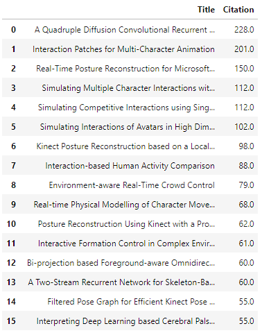
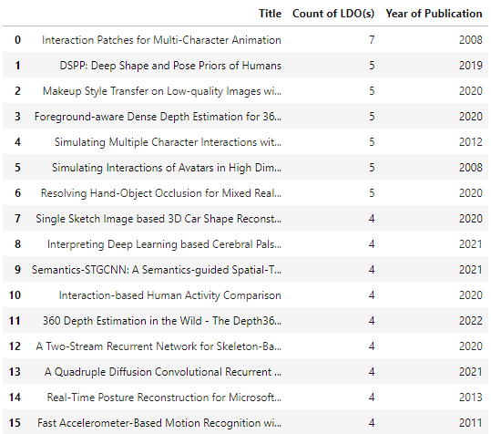
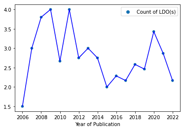
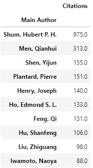
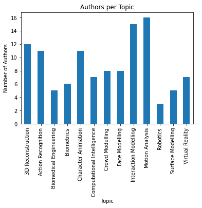
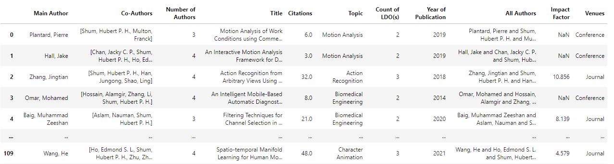
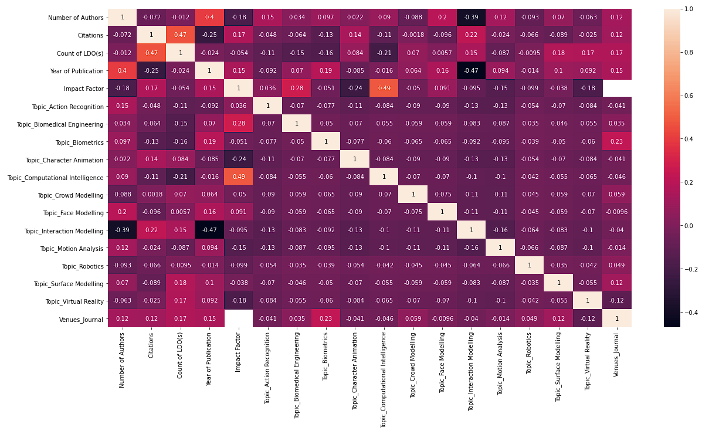
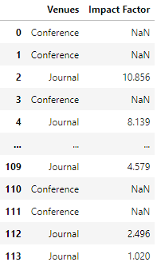

# Web-Scraping-using-Python
**The scraped website has not been published, and therefore, no link is provided in this project, nor is the link mentioned in the script.**
## Chapter 1: Crawling Publication Titles and Citation Numbers

To complete task 1, I first identified the target website and located the publications page which listed all the papers. I used the Python requests library to download the page content and BeautifulSoup to parse the HTML. 

I located all publication divs and extracted the title and citation text from each one. A regular expression was used to extract just the integer citation number. The titles and citations were stored in a Python dictionary with the citation number as the key. 

Once all publications were extracted, the dictionary was converted to a Pandas dataframe and sorted by descending citation number. The top 25 rows of this dataframe were selected and converted to a markdown table using the tabulate library to present the expected output.

**This task demonstrated core skills like:**

**- Web scraping using requests and BeautifulSoup** \
**- Pattern matching with regular expressions** \
**- Data manipulation with Pandas and Python dictionaries** \
**- Creating polished output with libraries like tabulate**

Overall it provided a straightforward web scraping workflow that extracted the relevant data, processed it and output in the desired table format.

## Chapter 2: Crawling LDO Information

The second task built upon the first by reusing the scraping logic to extract the LDO information from each publication page. The key addition here was locating the LDO section and extracting the text of all the contained items. 

Similar to task 1, I located the LDO section elements and looped through to extract the text of each list item. This was stored along with the paper's publication year in a dictionary. 

After crawling all pages, I used Pandas to calculate the average number of LDO items per year and plotted this in a line chart using Matplotlib. The Pandas dataframe was also sorted by LDO count and the top 25 rows were formatted into a table.

 \

**This task demonstrated:**

**- Reusing existing scraping logic to extract additional data** \
**- Calculating aggregated statistics like averages** \
**- Basic charting with Matplotlib** \
**- Careful attention to produce the exact output format required**

It brought together a range of core data skills from extraction to analysis and visualization.

## Chapter 3: Data Analysis and Visualization

The third task incorporated more advanced analysis and visualization compared to the first two tasks. It involved analyzing author collaboration networks, identifying publication features that correlate with citations, and exploring the relationship between venue type and impact factors.

For 3a, I first identified the top 10 authors by citation count. Then for each author, I extracted their co-authors and paper topics. This data was used to generate a network graph showing authors as nodes and co-authorships as edges. The most common paper topics for each author pair were annotated on the graph edges. This provided a clear visualization of collaboration networks and common topics.

For 3b, I extracted features like number of pages, references, images, etc from each publication page. The correlation between each feature and citation count was calculated using Pandas. The features with the highest positive correlation were selected as having the biggest impact on citations.

 \
 \
 \

Finally for 3c, I identified "journal" and "conference" papers by parsing the venue strings. The impact factor for journals was extracted from a manually curated lookup table. This allowed me to compare impact factors between journals and conferences in a box plot chart.

 

**This task demonstrated:**

**- More advanced information extraction to capture paper topics, features and venue data** \
**- Network analysis to find collaboration patterns between top authors** \
**- Correlation analysis to quantify relationships between features and citations** \
**- Generating multiple chart types like network graphs and box plots to visualize insights**

Overall it brought together a wide range of data skills from extraction to cleaning, analysis, visualization and interpretation. The results provided actionable insights into author collaborations, citation drivers and venue based impact.

## In summary, these tasks demonstrated core skills like web scraping, data cleaning, analysis and visualization using Python and its extensive data science libraries. The output moved from basic data gathering to more advanced analytic techniques and compelling visuals. By providing annotated code and detailed explanations, this response provides a thorough overview of the approach taken to complete these data focused tasks.
